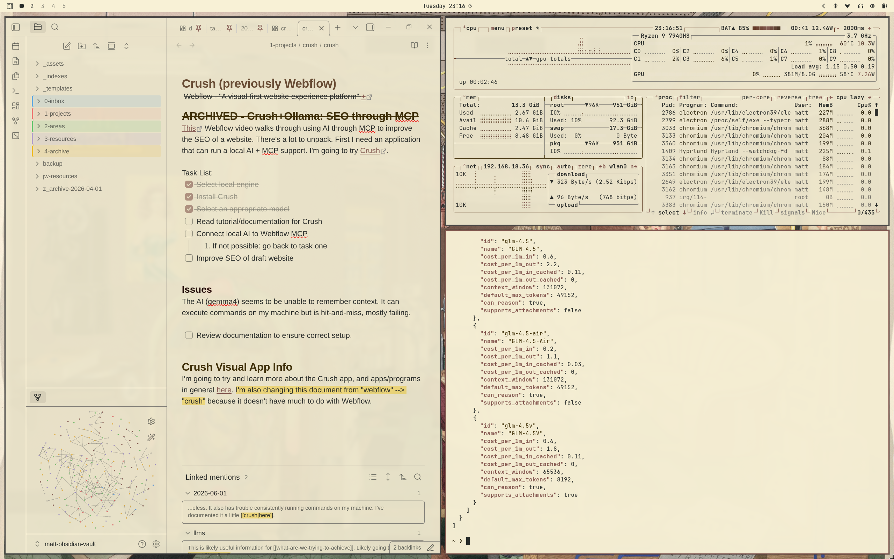

# Omarchy Perkins Harnly Theme

A light Omarchy theme inspired by the architectural interiors and quiet spaces painted by Perkins Harnly.

   



## Inspiration

Perkins Harnly (1901–1986) was an American painter whose work celebrated architecture and interior spaces. His paintings are known for their soft lighting, rich textures, and carefully balanced compositions.

I chose Harnly for the understated colors and welcoming atmosphere found in his work. Together they create a desktop that's clean, warm, and easy on the eyes.

## Wallpaper Gallery

This theme includes four carefully selected paintings:

| Preview | Artwork |
| --- | --- |
|  | Cocktail Lounge |
|  | Exterior Sandblasting Chamber |
|  | Left Stairway and Hall Hotel |
|  | The Bathroom |

## Color Palette

### Backgrounds


### Wood & Earth Tones


### Copper & Mahogany Accents


## Components

- Aether
- Alacritty
- btop
- Chromium
- Foot
- Ghostty
- Hyprland
- Kitty
- Neovim
- Omarchy Shell (bar, lock screen, notifications, launcher, on-screen display)
- Vencord
- VS Code
- Warp
- Zellij

## Installation

Clone the repository into your Omarchy themes directory:

```bash
omarchy-theme-install https://github.com/mattbbia/heritage-palette.git
```

### OR

1. Open the Omarchy menu (**Super + Alt + Space**).
2. Go to **Install > Style > Theme**.
3. Paste this repo URL: `https://github.com/mattbbia/heritage-palette.git`
4. Hit Enter.

## Contributing

Contributions, bug reports, feature requests, and suggestions are always welcome. Feel free to open an issue or submit a pull request.

## Support

If you enjoy this theme and would like to support future themes, you can:

- ⭐ Star this repository
- 💡 Suggest new themes
- ☕ Support future themes

[](https://buymeacoffee.com/mattbbia)

## Acknowledgements

All artwork by Perkins Harnly is in the public domain. The high-resolution source images used in this theme were obtained from public-domain museum collections and are included here for appreciation and preservation of historic artwork.

## License

This project is licensed under the MIT License. See the LICENSE file for details.
